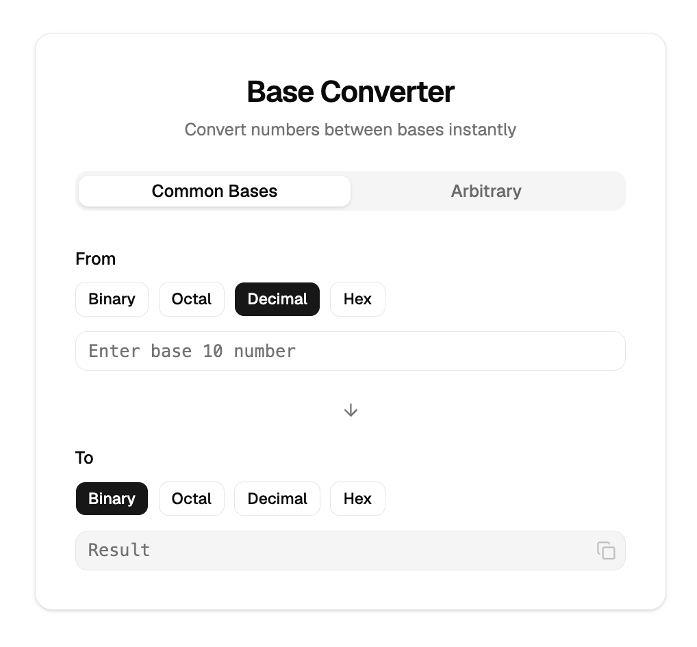

# Base Converter

> Convert numbers between bases — common (bin, oct, dec, hex) and arbitrary (base 2–36). Built with React, TypeScript, and shadcn/ui.



## Features

- **Common Bases tab** — quick conversion between Binary, Octal, Decimal, and Hex
- **Arbitrary tab** — convert between any base from 2 to 36
- Live conversion as you type — no submit button
- Input validation per base (invalid characters are rejected on keystroke)
- Copy-to-clipboard on the output field

## Tech Stack

- [React 19](https://react.dev) + [TypeScript](https://www.typescriptlang.org)
- [Vite](https://vite.dev)
- [shadcn/ui](https://ui.shadcn.com) (Nova preset, Radix UI)
- [Tailwind CSS v4](https://tailwindcss.com)
- [Vitest](https://vitest.dev)

## Getting Started

```bash
npm install
npm run dev
```

Open [http://localhost:5173](http://localhost:5173).

## Scripts

| Command | Description |
|---|---|
| `npm run dev` | Start dev server |
| `npm run build` | Production build |
| `npm test` | Run tests |
| `npm run preview` | Preview production build |

## License

Apache 2.0 — see [LICENSE](LICENSE).
